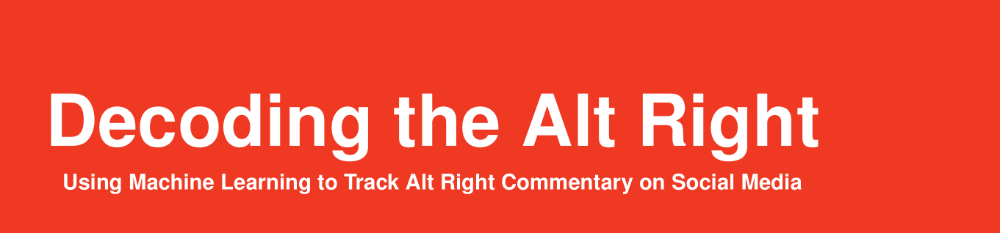
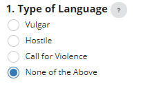
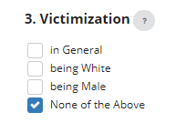
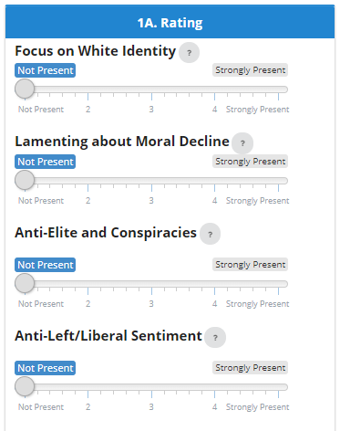
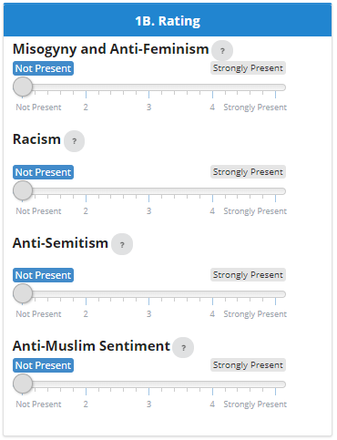

```{r setup, include = F}
knitr::opts_chunk$set(echo = TRUE)
```



The following section includes the instructions on how to code the comments and tweets, please feel free to reference those whenever you have trouble. In order to download or print the coding guidelines you can get a **PDF** version [**here**](https://github.com/favstats/Statistische-Modellbildung-II/raw/master/Instructions.pdf).

## **1. Type of Language**

<center>
  
</center>

Please select **only one** of the following options for the type of language. 

**Note:** The priority goes Vulgar < Hostile < Call for Violence

So if there is *Hostile* and *Vulgar Language* present, please code *Hostile Language*. If there is a *Call for Violence present*, that trumps all other options in priority.  

### Vulgar Language
 
Text includes swearwords, personal insults or cursing.

**Example for Vulgar Language:** 

> Get the fuck outta here talking bout the response will be better. You fucking ignorant stupid asshole.
  
### Hostile Language
 
Text includes derogatory remarks about an entire group of people (especially when based on their race, religion and/or gender). This includes stereotypes, humiliation, discrimination, race-, religion-, and/or gender-based insults.

**Example for Hostile Language:** 

> Because mudslimes are mudslimes for a reason. When you let mudslimes into your country, your people are going to spend the rest of their days getting raped and beheaded.


### Call for Violence

Text includes a call to act out violence against a certain group of people (especially when based on their race, religion and/or gender). This includes endorsing to kill or injure, mass deport, forcefully evict and/or segregate them.

**Example for Call for Violence:**

> Deport all immigrants who refuse to be deported or kill them if they resist this is literally the law.


## **2. Anti-Immigration** 

<center>
  
</center>


### Illegal Immigration

Text includes an opinion that wants to either curb so called "illegal immigration" or deport undocumented people from the country.

**Example for Illegal Immigration:**
 
> Illegal immigrants need to deported, right now. Trump will make this happen and there is nothing you liberal snowflakes can do about that.


### Non-Western Immigration (Culture)

Text makes references to immigrants that cannot/will not or have trouble integrating due to belonging to a "different culture".

**Example for Non-Western Immigration (Culture):**

> Immigrants from Islam countries CANNOT, WILL NOT and DON'T WANT to integrate in our soceity, our colture, so why have them over in the first place, fujk that shit.


### Non-White Immigration (Race)

Text makes references to immigrants that cannot/will not or have trouble integrating due to belonging to a different racial/ethnic group.

**Example for Non-White Immigration (Race):**

> Immigration from shithole brown countries means low IQ immigration and low IQ immigration means more crime, more rape, more glorious diversity. No thanks!


## **3. Feeling of Victimization**

<center>
  
</center>


### Feeling Victimized in General

Text mentions a feeling of being unfairly treated or oppressed without mentioning specifically on which grounds.

**Example for Feeling Victimized in General:**

> We've been told over and over again to listen to this pc dicatorship. I will not bow down to this any longer, screw it.

### Feeling Victimized due to being Male

Text mentions a feeling of being unfairly treated or oppressed because of being male.

**Example for Feeling Victimized due to being Male:** 

> Hillary's "Future Is Female" slogan is a dog whistle to the most extreme wing of the progressive feminist movement–where an explicitly anti-male, man-hating, female-obsessed culture prevails that unironically jokes about killing all men.


### Feeling Victimized due to being White

Text mentions a feeling of being unfairly treated or oppressed because of being white.

**Example for Feeling Victimized due to being White:**

> America has been pushing this kind of anti-white racism in the culture, the academy, the media and in leftist politics for better than the last ten years, worse every year. Of course this was on a campus of America's rancid Ivy League.

  
## **4. Irony and Trolling**

Is the person being ironic? Can the comment be reasonably interpreted as ironic or trolling? For example, does it look like it would mock someone's opinion rather than express one itself? Or is the comment being purposefully over-the-top?

**Example for Irony and Trolling:**

> A white ethnostate would be a great idea. Nobody will ever suffer any problems whatsoever then, I am sure of that.

## **5. Ideological Stances**

In this part we would like you to rate the presence of certain Alt Right attitudes. Please classify a text as *"Not present"* if there is no indication of that attitude and classify any text as *"Strongly present"* if the text endorses a particularly vile/strong version of that attitude. Use the number 2 - 3 to indicate states in between these two endpoints.

<center>

</center>


### Focus on White Identity
 
Text mentions a collective white identity/race. This could include expressing a wish about living in a white-majority country or "white ethnostate" and/or attributing achievements of historic Europeans to white people in general.

**Example for "Strongly present" Focus on White Identity:**

> Im sorry to say. This is going to sound extremely racist, but without all the white influence in this world back then, if there were never white people, this whole world would suck and be uncivilized. The world is a better place when there are white ethnostates.

### Lamenting about Moral Decline
   
Text laments about the process of declining from a higher to a lower level of morality. This would include complaining about "degeneracy", liberal sexual openness, acceptance of homosexuals and a feeling that traditional families and/or gender roles have been undermined.

**Example for "Strongly present" Lamenting about Moral Decline:**

> The west is a dying civilization. Should we be surprised that our culture is one that celebrates degeneracy, ugliness, and death? Homosexual depravity for all our children to see, no families, no children. I'll keep on trying to find something worth saving. Time marches and we circle the drain faster and faster.

### Anti-Elite/Establishment Sentiment and Conspiracy Theories
 
Text expresses animosities towards a ruling class (a person or class of persons considered superior by others or by themselves, as in intellect, talent, power, wealth, or position in society). This also includes ideas about conspiracies such as the "9/11 was an Inside Job" trope or believing that all of Mainstream Media is "Fake News".

**Example for "Strongly present" Anti-Elite/Establishment and Conspiracy Theories:**

>  This is just more establishment elitism, what if we simply don't accept the mainstream media FAKE NEWS lies no more and disregard whatever these fine uppity men and women want to tell us. The Trump collussion story is just as fake as 9/11 and any other false flag attack trying to make us all become behaved little sheeple.


### Anti-Left/Liberal Sentiment
 
Text includes a negative sentiment towards liberals or "the Left" as a whole. This would include but is not limited to the idea that liberals/leftists:

+ want to propagate *political correctness*, 
+ want to *censor/silence* everyone they disagree with,
+ undermine national unity or "western values"" (sometimes called "cultural Marxism"),
+ are Social Justice Warriors (SJWs) and/or snowflakes

**Example for "Strongly present" Anti-Left/Liberal Sentiment:**

> Liberal SJWs wants to censor or shut down anyone who oppose them. Insecure, whiney, narcissist snowflakes who have been given a position that allow them too much manipulation of many. Fuck Censorship. Fuck Political Correctness. Fuck Cultural Marxism.

<center>
  
</center>

### Misogyny and Anti-Feminism
 
Text expresses hatred, dislike, or mistrust of women, or prejudice against women. This includes expressing patriarchal and male-dominated notions of gender relations and seeing the advocacy for women's rights and Feminism as unnecessary/bad for society/women themselves.

**Example for "Strongly present" Misogyny and Anti-Feminism:** 

> Feminism will push women away from men. the idea that women don't need men is completely idiotic and dangerous. Patriarchy has always existed and will always exist and that's a good thing.

 
### Racism
 
Text expresses hatred, dislike, or mistrust of people of other races, or prejudice against them. This includes expressing the belief in the notion that humans may be divided into separate and exclusive biological entities called “races”; that there is a causal link between inherited physical traits and traits of personality, intellect, morality, and other cultural and behavioral features; and that some races are innately superior to others (also called *race realism*).

This comes often with the idea that people from "3rd world countries have low IQ" that makes them "biologically more inclined" to commit violence, which makes it more desirable to either limit non-white immigration, establish "white ethnostates" or enforce segregation by race.

**Example for "Strongly present" Racism:** 

> All blacks do benefit from the constant threat of theft and murder that keeps other races paranoid, wary, and untrusting and I don't even judge them because it is their biological makeup that makes them do this. This absolutely DOES justify segregation.

 
### Anti-Semitism
 
Text expresses hatred, dislike, or mistrust of people of Jewish, or prejudice against them. This includes expressing belief in anti-Jewish conspiracy theories, for example that Jewish people want to "undermine white identity" through advocating liberal and progressive ideals and notions that they want to eliminate white people through mass immigration and inbreeding ("white genocide"). 
This comes often with the idea that Jewish people as a whole control the media, the government, the banks and other positions of power. Tropes to look out for are three parentheses "((( )))" around a name to indicate that they are Jewish or to refer to the Holocaust as "holohoax" and mock the victim count by stating that "six gorillion people died". A dog-whistle that often means Jewish people is to refer to them as "globalists".

**Example for "Strongly present" Anti-Semitism:**

> (((Pro refugee groups))) are the ones demanding for white countries to have open borders and how 'racist' and 'bigoted' whites are for wanting their own country. Meanwhile they control the banks, the government and the media and want to makes us think it ain't so. I won't be guilt tripped by any holoxaux fake story anymore.
    
### Anti-Muslim Sentiment

Text expresses hatred, dislike, or mistrust of Muslims, or prejudice against them. This would include notions that Muslims are secretly plotting to establish Sharia law or that they are rapists and criminals who "invade the West". Another common trope is that all Muslims are designated as (potential) terrorists. Please also include extreme (mis-)characterizations of the religion of Islam that brandmark every believer as evil and/or untrustworthy.

**Example for "Strongly present" Anti-Muslim Sentiment:**

> We fight each other while we need to fight the muslims. Wake the uck up america.	these "reformers" are not real muslims,becuase it the quran it says to kill the infidels, this is what Islam tells them to do. If you see a muslim trying to rape your women or aboutto blow up, KILL him!!! It's very straight forward.

 

