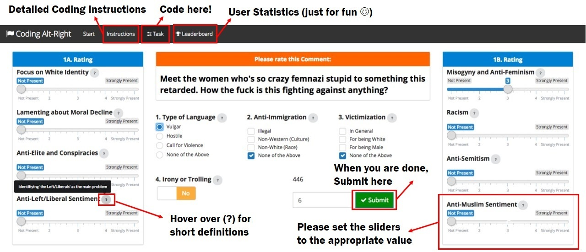

```{r setup, include=FALSE}
knitr::opts_chunk$set(echo = TRUE)
```

<center>
  <font size="+15">Welcome to the Alt Right Coding Project!</font>
</center>

<br>

Let us first thank you personally for participating in this project. It's great that you are taking the time to do this and we really appreciate it. Without your help, this project would not be possible in this way. Please feel free to contact us at any time if you have any questions.

<br>

# What is the Goal of this Project?

The goal of this project is to track the Alt Right on various Social Media platforms (Facebook, Twitter and YouTube). We seek to identify their content, talking points and narratives by applying machine learning algorithms and natural language processing such as sentiment analysis and topic modeling. In order to do this we accumulated a data set of *over 15 Million comments and tweets posted online during the entire year of 2017* from Social Media accounts that are associated with the Alt Right. 

\vspace{5pt}

Ultimately, we hope to make this data set publicly available (in an anonymized form), so that other researchers might be able to pursue their own research questions.
Interesting research questions might include: How did the Alt Right react to the Charlottesville rally in August 2017? How do they react to jihadist and/or right-wing extremist terror attacks? In which ways does the Alt Right differ from the Alt Light? What talking points do they share? 

\vspace{5pt}

The findings of this project will be presented at a [Voxpol Online-Extremism workshop at the University of Oxford](http://www.voxpol.eu/events/combating-online-extremism-state-private-sector-civil-society-responses-call-papers/).

<br>

# How can you contribute?

Help us code 500 comments/tweets (more is possible) that come from a wide variety of Social Media Accounts that are associated with the Alt Right. We included several scales that will be used to classify the commentary. We also hope to differentiate between the so-called "Alt-Light" and "Alt-Right". The following section includes the instructions on how to code the comments and tweets, please feel free to reference those whenever you have trouble.

**We would like to introduce you to the framework you will be using:**

<center>

</center>

<br>

You should start by reading the **Instructions**.

Once you feel confident enough, you can start labelling when you click on the **Task** Tab.

<br>

# Interested in some Academic Sources?

We recommend the following literature:

*Hawley, George. Making Sense of the Alt-right. Columbia University Press, 2017.*

[**Available here**](https://cup.columbia.edu/book/making-sense-of-the-alt-right/9780231185127)

*Marwick, Alice, and Rebecca Lewis. "Media manipulation and disinformation online." New York: Data & Society Research Institute (2017).*

[**Available here**](http://www.chinhnghia.com/DataAndSociety_MediaManipulationAndDisinformationOnline.pdf)


